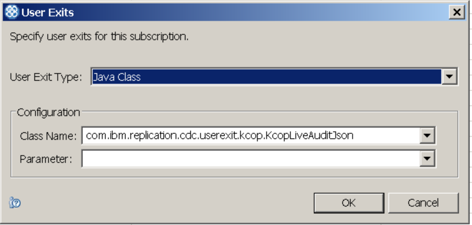

# IBM InfoSphere Data Replication User Exit - Kafka Custom Operator

## Installation
The GitHub repository contains the source but also the user exit in its compiled form, enclosed in a jar file. If you wish, you can build the jar file yourself using Ant, or to manually compile the user exit. If you wish to do so, please refer to the [Compilation](#compilation) section.

Download and unzip the master zip file from GitHub through the following link: [Download Zip](https://github.com/fketelaars/IIDR-UE-KCOP/archive/master.zip). The unzipped directory can be placed anywhere on the server that runs the CDC target engine; we recommend to unzip it under the CDC for Kafka engine's home directory (hereafter referred to as `<cdc_home>`)

## Configuration
In most scenarios you will need to perform a couple of configuration tasks:
- Update the configuration properties in the KcopLiveAuditJson.properties file
- Add the user exit and its configuration file to the classpath of the CDC *target* engine

### Setting the configuration properties
Update the `KcopLiveAudit.properties` file with your favourite editor.

An example of the LiveAudit properties can be found below

### Update the CDC engine's classpath
Assuming you have unzipped the file under the `<cdc_home>` directory, and the directory is called `IIDR-UE-KCOP-master`, add the following entries to the end of the classpath specified in the `<cdc_home>/conf/system.cp`:  
`:IIDR-UE-KCOP-master/lib/*:IIDR-UE-KCOP-master`

Example classpath for CDC engine:
 
 
The `lib/*` classpath entry is needed to let CDC for Kafka find the jar file; the main directory holds the properties file that is read from within the KcopLiveAudit user exit.

Once you have updated the classpath, restart the CDC instance(s) for the changes to take effect.

## Configuring the subscription
Now that the setup tasks have been done and the user exit is available to the CDC engine, you must create a subscription that targets the CDC for Kafka engine and map the tables.

**Note:** Even though the user exit removes the need for the schema registry to be installed and configured, you will still need to reference a (dummy) schema registry host name and port name in the subscription's Kafka properties.

Finally, configure the subscription-level user exit. The full name of the user exit is: `com.ibm.replication.cdc.userexit.kcop.KcopLiveAuditJson`. An optional parameter can be specified: the name of the configuration file that must be read for this subscription. If not unspecified, the user exit will read its properties from the `KcopLiveAuditJson.properties` file. Please note that the properties file must be found in the classpath as specified in the previous steps.

## Compilation
If you wish to compile the user exit yourself, the easiest method is to use Ant ([https://ant.apache.org/bindownload.cgi](https://ant.apache.org/bindownload.cgi)). 

Once you have this installed:
- Ensure that the ant executable is in the path
- Go to the directory where you unzipped the user exit master file
- Update the `ant.properties` and update the `CDC_ENGINE_HOME` property to match the location where you installed the CDC engine
- Check the target version to be used (this is the Java version of the compiled objects) and should match the version of the Java Runtime Engine that is included with CDC
- Run `ant`
- First the sources will be compiled into their respective .class files and finally the class files are packaged into a jar file that is contained in the `lib` directory
